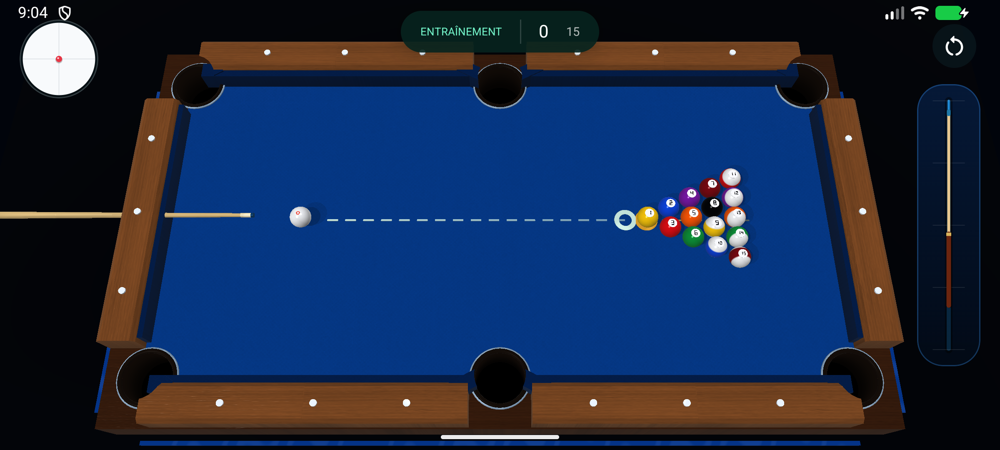

# Billard : visibilité et stabilité — 30 août 2026

## Périmètre

Amélioration du billard existant sur Android et iOS. Aucun changement de moteur
annoncé, aucun déploiement, aucune modification Firebase ou des données utilisateur.

## Corrections

- Caméra fixe pendant la visée, le tir et l'arrêt ; cadrage recalculé seulement
  lorsque les dimensions d'affichage changent. Le pincement ne déplace plus la
  table de billard.
- Six ouvertures traversant le tapis et le socle, avec intérieur sombre en retrait.
  Android : centres alignés sur les coordonnées du moteur de physique.
  iOS : bandes séparées pour laisser ouvertes les poches centrales et les angles.
- Orientation des faces corrigée pour cylindres, cônes, queue et anneaux Android.
  Correction des normales des objets redimensionnés et de la précision du shader.
- Boules rayées peintes sur une sphère, sans anneau saillant ; numéros plus lisibles,
  reflets moins brûlés, ombres ramenées au tapis. Rotation Android accumulée à partir
  du déplacement réel, sans retour brutal quand la vitesse diminue.
- Bois avec grain orienté, brillance réduite, bandes chanfreinées ; queue effilée,
  virole et procédé distincts.
- Android : simulation synchronisée avec les frames, angle de visée corrigé selon
  les proportions physiques de la table, y compris dans le mode en ligne.
- Mentions Vulkan/GPU retirées du parcours de jeu ; consignes permanentes retirées
  du tapis. Commandes déplacées pour dégager les six poches.

## Fichiers concernés

- `android/app/src/main/java/com/whappy/chat/WapiPoolPresentation.kt`
- `android/app/src/main/java/com/whappy/chat/WapiTabletop3DView.kt`
- `android/app/src/main/java/com/whappy/chat/WhappyUi.kt`
- `android/app/src/main/java/com/whappy/chat/WapiOnlinePool.kt`
- `android/app/src/test/java/com/whappy/chat/WapiPoolPresentationTest.kt`
- `ios/Whappy/ContentView.swift`
- `ios/Whappy/WapiGameSceneKit.swift`

## Contrôles réalisés

- Android : `:app:assembleDebug :app:testDebugUnitTest` réussi, 55 tests sans échec.
- Nouveaux tests : faces visibles et normales concordantes, six centres de poches,
  visée diagonale correcte, cadrage sur six rapports d'écran (dont formats pliables).
- Émulateur Android API 36.1, rendu logiciel : ouverture, visée, tir par glissement,
  mouvement des boules et retour à l'arrêt contrôlés. Cadrage identique avant et
  pendant le tir. Le banc de test est réservé à la variante debug, sans accès aux
  comptes de production.
- Comparaison de quatre zones fixes du bois, avant / pendant / après le tir :
  différence moyenne des pixels = 0 sur les deux comparaisons (captures 2400 × 1080).
- Swift : syntaxe et types du fichier SceneKit contrôlés séparément.
- iOS : compilation complète du workspace `Whappy`, Debug / simulateur ARM64,
  réussie avec Xcode, sans signature de distribution.

La mesure du débit d'images sur téléphones physiques et la validation visuelle iOS
sur appareil restent distinctes de ces contrôles. Aucun niveau de performance
« 60 FPS » ni aucune équivalence avec un jeu commercial n'est certifié ici.
